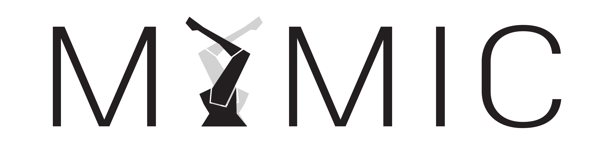

#

### What is Mimic?

[Mimic](https://www.mimicformaya.com/) is a free and open-source plugin for
[Autodesk Maya](https://www.autodesk.com/products/maya/overview) that enables
simulation, programming, and control of 6-axis, Industrial Robots. It provides
a robust and intuitive, animation-based toolset, allowing creators to
prototype, validate, and drive automated systems, without writing any code.
Written in Python 2.7.


### Installation

Download this release and copy the contents of it to one of the following
directories, depending on your operating system. When you're done, open Maya,
click on the Mimic shelf tab, and click on the Mimic icon; that's it!

```
macOS   ~/Library/Preferences/Autodesk/maya/modules
Windows ~/Documents/maya/modules
```

\* _If the directory_`/modules` _doesn't exist, create it._

\*\* _If you're using Maya 2017 update 3 or earlier, you must
[manually load the Mimic shelf](https://youtu.be/bc3SqEXcE5Q?t=1m46s)._

You can find tutorials, videos, and other media on our
[website](https://www.mimicformaya.com/) and textual documentation in
[docs](mimic/docs).


### Currently supported robots

*Let us know if what you need isn't listed and we'll try to help!*

Mimic currently supports the following Robots (see [rigs](mimic/rigs)):

```
ABB
|-- IRB-6700-205-280
KUKA
|-- AGILUS-R900
|-- KR5-R1400
|-- KR5-arc
|-- KR60-3
```

Mimic currently supports the following Post Processors
(see [postproc](mimic/scripts/postproc)):

```
ABB
|-- RAPID
KUKA
|-- EntertainTech *
|-- KRL
```

\* _external installation option required_


### Join the community!

Help us out and contribute to this repository!
You may submit an issue or open a pull request for any bugs or improvements to
this software. See [devnotes](mimic/docs/devnotes.md) for programming guidelines.

Join the our [slack channel](https://www.mimicformaya.com/#community-section)!
You may also contact us at [mimic@autodesk.com](mailto:mimic@autodesk.com).

*Mimic was originally conceived of and created by Evan Atherton at the Applied
Research Lab, Autodesk 2018.* It is now developed and contributed to by a
community of animators, designers, engineers, architects, programmers, and more.
See [AUTHORS](AUTHORS.md) for details.


### License

Mimic is licensed under the MIT license.
See [LICENSE](LICENSE.md) for details.


### Notes

- Be careful out there! Mimic is not a safety certified monitoring tool.
  Users of this software are responsible for safe robot programming and operation.
  Developers of this software are not responsible for any result of its use.
- Developed to work with Autodesk Maya 2016, Autodesk Maya 2017, and Autodesk
  Maya 2018; Mimic may or may not be compatible with other versions.
- Developed to work with macOS and Windows; Maya is not compatible with other
  operating systems but *most* of the Mimic backend is.
- Do not modify names or hierarchies internal to robot assets!
- Use Maya's default units: Centimeters, Degrees
- Use Maya's default coordinate system: Y-Up
- Note that this repository does not include robot rigs or Maya scenes, though
  your application will require them.


#
